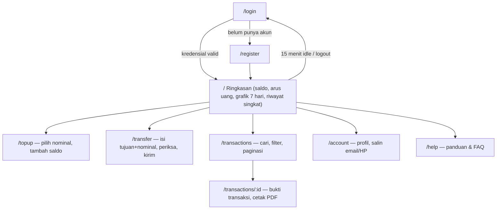

# Saku — Mini Wallet Dashboard

SPA (Single Page Application) untuk **Saku**, dompet digital mini: login/registrasi, ringkasan saldo dengan grafik aktivitas, top up, transfer dua tahap, riwayat mutasi yang dapat dicari, dan bukti transaksi yang bisa dicetak. Antarmuka berbahasa Indonesia, responsif desktop–mobile, memakai permukaan kaca (glassmorphism), animasi yang menghormati `prefers-reduced-motion`, dan state hover/active/focus di setiap elemen interaktif.

Backend-nya (Laravel API) ada di repo terpisah: **[saku-api](https://github.com/DannZ10/saku-api)**.

## Tech stack

| Bagian | Teknologi | Versi |
| --- | --- | --- |
| Framework | Next.js (App Router) | 16.x |
| UI library | React | 19.x |
| Styling | Tailwind CSS | 4.x |
| Komponen primitif | shadcn/ui (di atas Radix UI) | — |
| Ikon | lucide-react | — |
| Server state | TanStack Query | 5.x |
| Grafik | Recharts | 3.x |
| Runtime | Node.js | 20.9+ (diuji pada 24.x) |

> Catatan: **TanStack Table tidak lagi dipakai** — dilepas karena `useReactTable` tidak kompatibel dengan React 19.2 + Next 16 dan menyebabkan freeze. Lihat bagian [Bug freeze & solusinya](#bug-freeze--solusinya).

## Struktur (Atomic Design)

```
src/
  components/
    atoms/        button, input, dialog, brand        — primitif murni
    molecules/    field, nav-item                      — komposit reuse
    organisms/    auth-screen, money-form, transaction-table, transaction-detail,
                  activity-chart, session-guard, sidebar, topbar, mobile-nav,
                  overview, action-panel, account-panel, help-panel, navigation
    templates/    dashboard-shell                       — container data + state + layout
  app/            login, register, /, topup, transfer, transactions,
                  transactions/[id], account, help      — route pages (tipis)
  lib/            api, session, transaction, utils
```

Setiap route page hanya memilih *view*; `DashboardShell` (template) yang memegang data wallet, state sesi, dan layout, lalu menyerahkan potongannya ke tiap organism sebagai props.

## Alur pengguna



## Keamanan & sesi

- **Token tidak di browser.** Sanctum token diterima route handler Next.js di server dan disimpan pada cookie `saku_session` — `httpOnly`, `SameSite=Strict`, `Secure` di production. Token tidak pernah ada di `localStorage` atau respons login browser.
- **Idle auto-logout.** Sesi berakhir otomatis setelah **15 menit** tanpa aktivitas: dialog peringatan dengan hitung mundur, lalu logout dan kembali ke halaman masuk. Umur token Sanctum 8 jam tetap menjadi batas mutlak. Diatur lewat `NEXT_PUBLIC_SESSION_IDLE_MINUTES`.
- **Perlindungan CSRF.** Semua POST dari browser dicocokkan exact-Origin terhadap daftar `APP_ORIGIN`.
- **Anti spam-klik.** Tombol submit dinonaktifkan selama request berjalan + penjaga sinkron agar klik cepat tidak membuat request ganda.

## Bug freeze & solusinya

### Gejala
Mengklik menu sidebar atau tombol dashboard mana pun **membekukan halaman**: klik berhenti merespons sementara **scroll masih jalan**, dan Chrome akhirnya menawarkan menutup halaman "Page Unresponsive". Terjadi juga di **Incognito** (tanpa ekstensi) → berarti bug aplikasi, bukan ekstensi browser.

### Cara menemukannya (bisect)
Karena konsol bersih (tanpa error React) dan freeze membekukan main thread, penyebabnya dipersempit dengan mematikan bagian halaman overview satu per satu:

| Kondisi overview | Klik menu |
| --- | --- |
| grafik + tabel | **freeze** |
| grafik + tabel dilepas | jalan |
| hanya grafik (tabel dilepas) | jalan |
| tabel dikembalikan | **freeze lagi** |

Satu variabel penentu: komponen **`TransactionTable`**.

### Root cause
`TransactionTable` memakai **`useReactTable` (TanStack Table v8)** yang **tidak kompatibel dengan React 19.2 + Next 16**. ESLint sudah menandainya (`react-hooks/incompatible-library`: *"useReactTable returns functions that cannot be memoized safely"*).

Kehadiran hook itu **membatalkan setiap transisi navigasi client-side**. Saat menu diklik, handler `<Link>` berjalan dan memanggil `router.push` (`defaultPrevented` = `true`), tetapi transisi **tidak pernah commit** — `history.pushState` tidak pernah terpanggil, tanpa error, tanpa perubahan DOM. Di mesin cepat tampak seperti klik mati; di mesin lebih lambat React **me-retry render yang gagal terus-menerus** hingga main thread pentok → dialog "Page Unresponsive". Scroll selamat karena berjalan di *compositor thread*, terpisah dari main thread.

### Solusi
Render tabel riwayat sebagai **`<table>` semantik biasa** yang me-map baris langsung. Filter, pencarian, dan paginasi memang sudah dikerjakan server-side, jadi hook tabel hanya me-render baris — melepasnya menghilangkan sumber bug **dan** memangkas kode. Dependency `@tanstack/react-table` dihapus dari `package.json`.

Diverifikasi pada production build: login lalu setiap navigasi sidebar/menu/tombol (ringkasan, top up, transfer, riwayat, akun, panduan) **commit instan** dan halaman **tetap responsif**. Commit perbaikan: `fix: stop dashboard freezing on menu clicks (drop useReactTable)`.

## Cara run

Prasyarat: Node.js 20.9+, dan **[saku-api](https://github.com/DannZ10/saku-api) berjalan di `http://127.0.0.1:8000`**.

```powershell
npm install
Copy-Item .env.example .env.local
npm run dev
```

Buka `http://127.0.0.1:3001` (atau `http://localhost:3001`). Login dengan akun demo `ayu@saku.test` / `SakuDemo123!`.

Environment (`.env.local`):

| Variabel | Guna |
| --- | --- |
| `API_URL` | Base URL backend, mis. `http://127.0.0.1:8000/api` |
| `APP_ORIGIN` | Daftar origin yang boleh POST (CSRF), pisahkan koma. Sertakan setiap alamat yang dipakai membuka app — `127.0.0.1` dan `localhost` dihitung berbeda |
| `NEXT_PUBLIC_SESSION_IDLE_MINUTES` | Menit idle sebelum sesi ditutup (default 15) |

Verifikasi & produksi:

```powershell
npm run lint
npm run build
npm run start        # sajikan build produksi (navigasi instan, tanpa kompilasi on-demand)
```

> **Untuk pengetesan gunakan `npm run start`**, bukan `npm run dev`. Mode dev mengkompilasi tiap route saat pertama diklik (bisa belasan detik di drive/path lambat); produksi menyajikan semua route pra-kompilasi.
